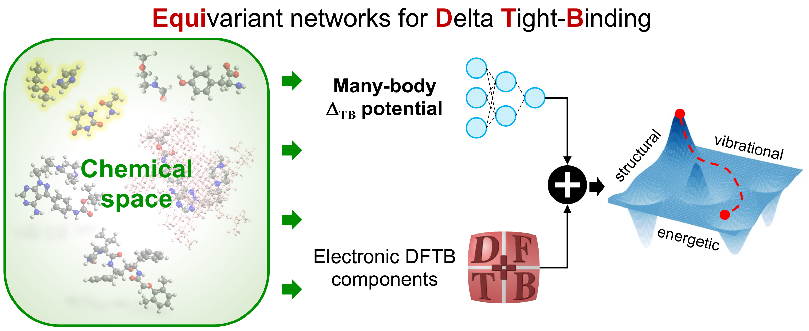

[](https://chemrxiv.org/engage/chemrxiv/article-details/68095e1d927d1c2e667c750a)
# EquiDTB: Equivariant many-body $\Delta_{\rm TB}$ potentials for molecular simulations

## About
We introduce the EquiDTB framework, which leverages physics-inspired equivariant neural networks to parameterize scalable and transferable many-body $\Delta_{\rm TB}$ potentials, replacing the standard pairwise repulsive potential in the DFTB method. This advancement extends the applicability of our previous ML-corrected DFTB approach [NNrep](https://pubs.acs.org/doi/full/10.1021/acs.jpclett.0c01307) to compute energetic, structural, vibrational, and dynamics properties of larger molecules and non-covalent systems at DFT-PBE0 accuracy supplemented with a many-body dispersion treatment for van der Waals interactions.

<p align="center">
  
</p>

## QM datasets

The quantum-mechanical property data used to train the EquiDTB models can be downloaded from the ZENODO repository https://zenodo.org/records/17433999.

## EquiDTB models

- EquiDTB25: trained on small molecules from QM7-X dataset.
- EquiDTB26: trained on small molecules from QCML dataset.

## Computing with EquiDTB framework

### Installation
Install MACE following the instructions in [MACE GitHub](https://github.com/ACEsuit/mace?tab=readme-ov-file#installation).
```bash
pip install --upgrade pip
pip install mace-torch
```
Install `DFTB+` code and `ASE` python package to combine the MACE and DFTB calculators. 
```bash
conda install -n equidtb mamba
mamba install 'dftbplus=*=mpi_openmpi_*'

# additional components like the dptools and the Python API

mamba install dftbplus-tools dftbplus-python
conda install conda-forge::ase
```
For more information regarding DFTB+ installation, you can visit [DFTB+ Recipes](https://dftbplus-recipes.readthedocs.io/en/latest/introduction.html).

> **Note1**: It is necessary to replace the `dftb.py` file from the **calculators** directory in the `ASE` package with the one provided in this repository (see `ase_calc_dftb.py`). This modified ASE-DFTB calculator includes the  reference values for Hubbard Derivatives.
```bash
cp ase_calc_dftb.py /path/to/.conda/envs/qued/lib/python3.9/site-packages/ase/calculators/dftb.py
```
> **Note2**: If you encounter any conflicts after installing these packages, you can check the package versions in the `environment.yml` file.

### Setting up DFTB+ ASE calculator
The current version of EquiDTB models consider only C, N, O, and H elements. To run calculations using these models and ASE calculator, you should first download the Slater-Koster parameters corresponding to the 3ob set (visit [dft.org](https://dftb.org/parameters/download.html#)). Moreover, you must add the following environment variables to your shell (e.g., in .bashrc, .zshrc, or your job script), replacing the placeholder paths with your own installation paths:
```bash
# Path to your DFTB+ executable (MPI-enabled if available)
export DFTB_COMMAND='mpiexec -n 1 /path/to/dftb+/bin/dftb+'
# Path to the DFTB+ parameter set (e.g., 3ob-3-1 directory)
export DFTB_PREFIX='/path/to/slater-koster-files/3ob-3-1/'
# Set number of OpenMP threads (must be 1 if running under MPI)
export OMP_NUM_THREADS=1
```

### Single point calculation 
This is a simple python script file that combines the developed `EquiDTB3 model` with the DFTB3 electronic components. We have also considered the flags related to many-body dispersion interactions; however, you can remove them if it is not required for your calculations.
```python
from ase.io import read, write
from ase.calculators.dftb import Dftb
import ase.calculators.mixing

# Load MACE calculator
from mace.calculators import MACECalculator
MLcalc = MACECalculator(model_path="/path/to/model/EquiDTB3.model", device='cpu', default_dtype="float32")

# Read structure file
atoms = read("xyz_file.xyz")

# Load DFTB calculator with MBD
DFTBcalc = Dftb(label='current_dftb',
                atoms=atoms,
                Hamiltonian_SCC = 'Yes',
                Hamiltonian_ThirdOrderFull = 'Yes',
                Hamiltonian_PolynomialRepulsive_ = '',
                Hamiltonian_PolynomialRepulsive_setForAll = '{Yes}',
                Hamiltonian_Dispersion_ = 'MBD',
                Hamiltonian_Dispersion_KGrid = '1 1 1',
                Hamiltonian_Dispersion_Beta = 0.83, 
                Hamiltonian_Dispersion_NOmegaGrid = 25,
                Hamiltonian_Dispersion_ReferenceSet = 'ts',
                ParserOptions_ParserVersion = '13')

# Mixing calculators
QMMLcalc =  ase.calculators.mixing.SumCalculator([DFTBcalc,MLcalc])

atoms.set_calculator(QMMLcalc)

energy = atoms.get_total_energy()
forces = atoms.get_forces()

print('Energy and forces in ASE')
print('Energy = ', energy)
print('Forces = ', forces)
```
To run calculations using the `EquiDTB1 model`, you should change the settings only in the ASE-DFTB calculator,
```python
DFTBcalc = Dftb(label='current_dftb',
                atoms=atoms,
                Hamiltonian_SCC = 'No',
                Hamiltonian_PolynomialRepulsive_ = '',
                Hamiltonian_PolynomialRepulsive_setForAll = '{Yes}',
                Hamiltonian_Dispersion_ = 'MBD',
                Hamiltonian_Dispersion_KGrid = '1 1 1',
                Hamiltonian_Dispersion_Beta = 0.83,
                Hamiltonian_Dispersion_NOmegaGrid = 25,
                Hamiltonian_Dispersion_ReferenceSet = 'ts',
                ParserOptions_ParserVersion = '13')
```

### Validation benchmarks
We have considered several challenging calculations to validate the performance of the EquiDTB models. Among them,

- `S66x8 molecular dimers`: Calculation of interaction energy and atomic forces.
- `Nudged elastic band (NEB) calculations`: Determination of the minimum energy path between conformers of large molecules.
- `Molecular dynamics simulations`: Conformational sampling at constant temperature of flexible molecules.
- `Vibrational properties`: Computation of vibrational frequencies of amino acids.
- `Energetic ranking`: Predicting energetic ranking and atomic forces of [Aquamarine](https://www.nature.com/articles/s41597-024-03521-8) molecules.

Reference data were computed using PBE0+MBD level, as implemented in the [FHI-aims code](https://fhi-aims.org). Python scripts and reference data to perform these validations can be found in the `./Validations/` folder.

## Citation
If you use parts of the code please cite
```
@Article{equidtb,
author ="Medrano Sandonas, Leonardo and Puleva, Mirela and Erarslan, Zekiye and Parra Payano, Ricardo and Stöhr, Martin and Cuniberti, Gianaurelio and Tkatchenko, Alexandre",
title  ="Advancing density functional tight-binding method for large organic molecules through equivariant neural networks",
journal  ="Phys. Chem. Chem. Phys.",
year  ="2026",
pages  ="-",
publisher  ="The Royal Society of Chemistry",
doi  ="10.1039/D6CP00038J",
url  ="http://dx.doi.org/10.1039/D6CP00038J",
}

@article{stoehr20,
author = {Stöhr, Martin and Medrano Sandonas, Leonardo and Tkatchenko, Alexandre},
title = {Accurate Many-Body Repulsive Potentials for Density-Functional Tight Binding from Deep Tensor Neural Networks},
journal = {The Journal of Physical Chemistry Letters},
volume = {11},
number = {16},
pages = {6835-6843},
year = {2020},
doi = {10.1021/acs.jpclett.0c01307},
}
```
