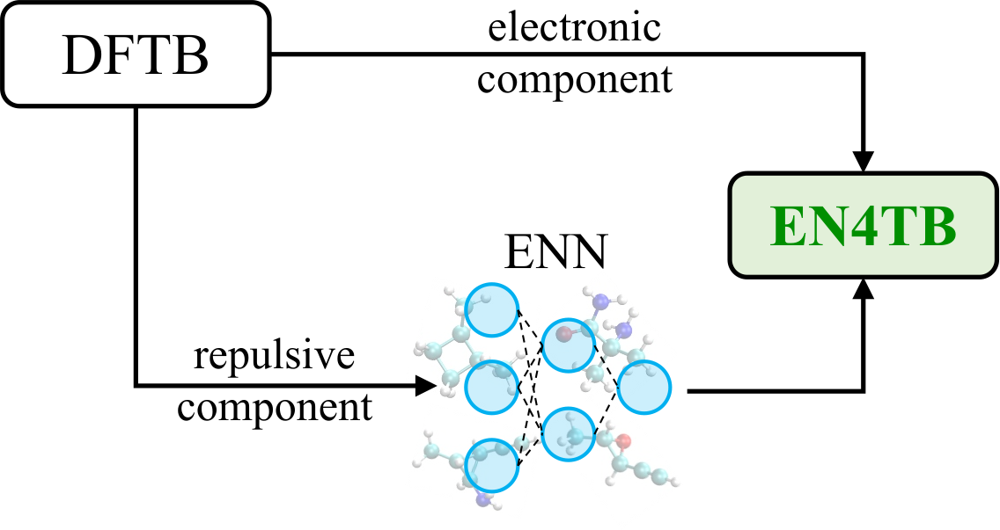

[](https://chemrxiv.org/engage/chemrxiv/article-details/68095e1d927d1c2e667c750a)
# EquiDTB: Equivariant many-body $\Delta$ potentials for DFTB simulations

## About
We introduce the EquiDTB framework, which leverages physics-inspired equivariant neural networks to parameterize scalable and transferable many-body $\Delta_{\rm TB}$ potentials, replacing the standard pairwise repulsive potential in the DFTB method. This advancement extends the applicability of our previous ML-corrected DFTB approach [NNrep](https://pubs.acs.org/doi/full/10.1021/acs.jpclett.0c01307) to larger molecules and non-covalent systems.

<p align="center">
  
</p>

## Computing with EquiDTB model
This is a simple python script file that combines the developed EquiDTB model with the DFTB3 electronic components,
```python
from ase.io import read, write
from ase.calculators.dftb import Dftb
import ase.calculators.mixing

# Load MACE calculator
from mace.calculators import MACECalculator
SPcalc = MACECalculator(model_path="MACE_model", device='cpu', default_dtype="float32")

# Read structure file
atoms = read("xyz_file.xyz")

# Load DFTB calculator with MBD
DFTBcalc = Dftb(label='current_dftb',
                atoms=atoms,
                run_manyDftb_steps=True,
                Hamiltonian_SCC = 'Yes',
                Hamiltonian_ThirdOrderFull = 'Yes',
                Hamiltonian_PolynomialRepulsive_ = '',
                Hamiltonian_PolynomialRepulsive_setForAll = '{Yes}',
                Hamiltonian_Dispersion_ = 'MBD',
                Hamiltonian_Dispersion_KGrid = '1 1 1',
                Hamiltonian_Dispersion_Beta = 0.83, 
                Hamiltonian_Dispersion_NOmegaGrid = 25,
                Hamiltonian_Dispersion_ReferenceSet = 'ts',
                )

# Mixing calculators
QMMMcalc =  ase.calculators.mixing.SumCalculator([DFTBcalc,SPcalc], atoms)

atoms.set_calculator(QMMMcalc)

energy = atoms.get_potential_energy()
forces = atoms.get_forces()

print('Energy and forces in ASE')
print('Energy = ', energy)
print('Forces = ', forces)
```

## Citation
If you use parts of the code please cite
```
@article{Medrano25, 
author={Medrano Sandonas, Leonardo and Puleva, Mirela and Parra Payano, Ricardo and Stöhr, Martin and Cuniberti, Gianaurelio and Tkatchenko, Alexandre}, 
title={Advancing Density Functional Tight-Binding method for Large Organic Molecules through Equivariant Neural Networks}, 
DOI={10.26434/chemrxiv-2025-z3mhh}, 
journal={ChemRxiv}, 
year={2025},
}

@article{stoehr20,
author = {Stöhr, Martin and Medrano Sandonas, Leonardo and Tkatchenko, Alexandre},
title = {Accurate Many-Body Repulsive Potentials for Density-Functional Tight Binding from Deep Tensor Neural Networks},
journal = {The Journal of Physical Chemistry Letters},
volume = {11},
number = {16},
pages = {6835-6843},
year = {2020},
doi = {10.1021/acs.jpclett.0c01307},
}
