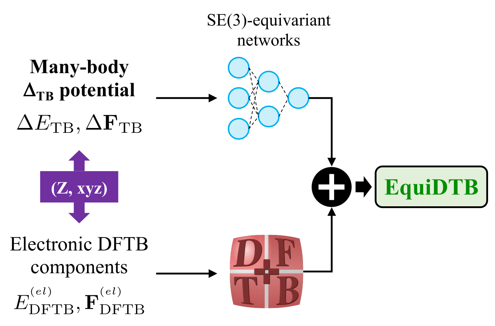

# EquiDTB
Equivariant many-body Delta potentials for DFTB simulations



## Citation
If you use parts of the code please cite
```
@article{stoehr20,
author = {Stöhr, Martin and Medrano Sandonas, Leonardo and Tkatchenko, Alexandre},
title = {Accurate Many-Body Repulsive Potentials for Density-Functional Tight Binding from Deep Tensor Neural Networks},
journal = {The Journal of Physical Chemistry Letters},
volume = {11},
number = {16},
pages = {6835-6843},
year = {2020},
doi = {10.1021/acs.jpclett.0c01307},
}
